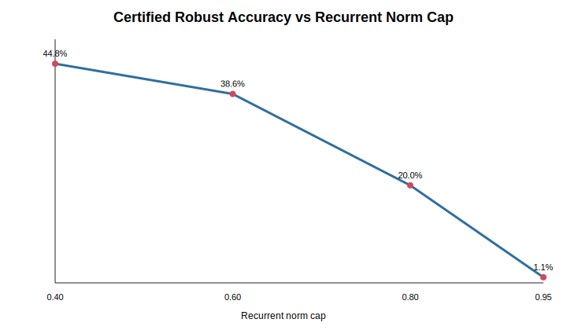
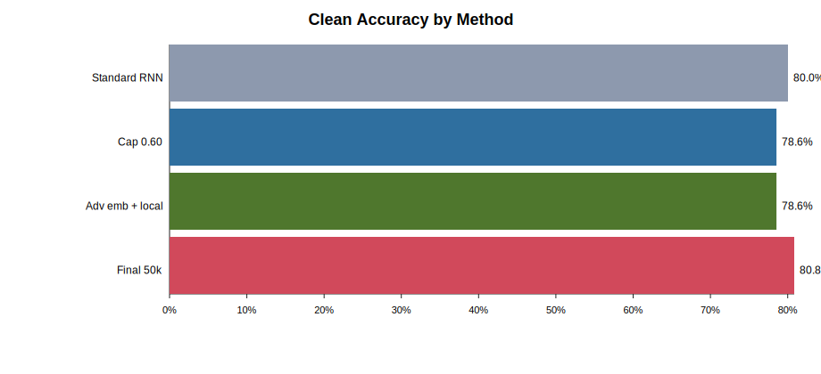
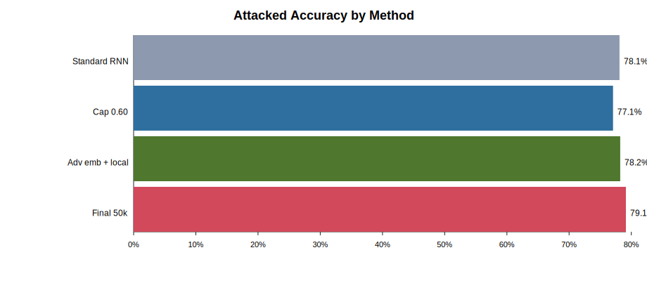
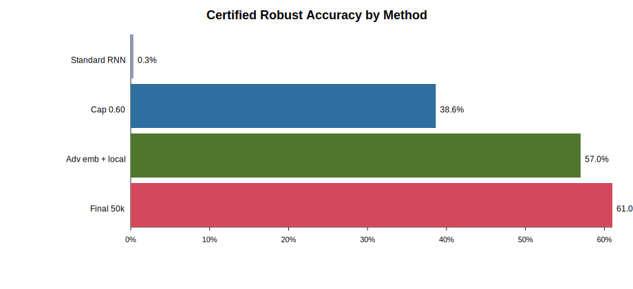

# IQC-Inspired Robustness Analysis for Text Classification

## Abstract

This report studies how robustness analysis based on continuous perturbation bounds can be adapted to a discrete text-classification setting. The motivating reference is the quadratic-constraint robustness framework of Fazlyab, Morari, and Pappas, which analyzes neural networks under bounded continuous input uncertainty. Since text inputs are discrete, the proposed adaptation maps token-level attacks to perturbations in the embedding space of a sentiment classifier. A recurrent neural network is trained on SST-2, evaluated under synonym and typo perturbations, and assigned a certified robustness score using a conservative bound on logit variation. The experiments show that ordinary RNN training gives reasonable empirical robustness but almost no certified robustness. Constraining the recurrent dynamics substantially improves certified robustness, demonstrating that stability-oriented training is important when applying control-theoretic robustness ideas to sequential text models.

## 1. Objective

The task is to construct a clear use case for robustness analysis of text-related models using ideas from Integral Quadratic Constraints (IQCs) and quadratic neural-network verification. The original method is designed for continuous state spaces. Text classification, however, operates on discrete tokens, so direct application is not possible without a continuous relaxation.

The central objective is therefore:

```text
discrete text attack -> embedding-space perturbation -> output-margin certificate
```

The implemented use case focuses on binary sentiment classification on SST-2. The model is intentionally simple: a tanh RNN classifier. This makes the sequential nonlinear block explicit and allows a transparent robustness certificate.

## 2. Dataset and Model

The experiments use the local SST-2 dataset:

- training split: 67,349 examples,
- development split: 872 examples,
- task: binary sentiment classification.

Most experiments train on a 20,000-example subset for speed and controlled comparison. One ablation uses 50,000 examples.

The classifier has the following structure:

```text
tokens -> embedding layer -> tanh RNN -> mean hidden-state readout -> binary logit
```

For token embedding `e_t`, hidden state `h_t`, and output logit `z`, the model is:

```text
h_t = tanh(Wx e_t + Wh h_{t-1} + b)
h_bar = (1 / T) sum_t h_t
z = Wo h_bar + bo
```

The predicted sentiment is positive when `z >= 0` and negative otherwise. The mean hidden-state readout was used instead of the final hidden state because SST-2 sentences are short and sentiment-bearing words may appear anywhere in the sequence.

## 3. Attack Model

Two token-level perturbation types are used:

1. **Synonym substitution** using a small sentiment/movie-domain dictionary, for example `film -> movie` or `charming -> delightful`.
2. **Typo injection** by swapping adjacent characters inside one eligible word.

For a changed token, the discrete perturbation is mapped into embedding space:

```text
Delta e_t = E(attacked_token_t) - E(original_token_t)
```

This gives a sentence-specific perturbation budget. The attack is not treated as arbitrary character noise; it is treated as a bounded displacement in the continuous embedding representation consumed by the model.

## 4. Certified Robustness Score

The certificate estimates whether the classifier's decision can change under the observed embedding perturbation budget. Since `tanh` is 1-Lipschitz, hidden-state perturbations can be bounded recursively:

```text
||Delta h_t|| <= ||Wx|| ||Delta e_t|| + ||Wh|| ||Delta h_{t-1}||
```

For the mean readout, the per-step hidden-state bounds are averaged, then multiplied by the output-layer norm:

```text
|Delta z| <= ||Wo|| * mean_t bound(Delta h_t)
```

A prediction is certified robust when the clean logit margin is larger than the worst-case logit movement:

```text
|z_clean| > bound(|Delta z|)
```

This certificate is conservative. It does not solve the full semidefinite program from the paper. Instead, it implements a scalable IQC-inspired relaxation: the nonlinear recurrent block is replaced by a norm-bounded continuous constraint sufficient to prove that the output cannot cross the decision boundary.

## 5. Relation to the Quadratic-Constraint Paper

The reference paper analyzes neural networks by bounding nonlinearities with quadratic constraints and using those constraints to certify robustness over continuous input sets. The present implementation adapts the same conceptual structure to text:

| Paper setting | Text-classification adaptation |
|---|---|
| Continuous input uncertainty | Embedding-space displacement from token attacks |
| Neural network nonlinearities | tanh recurrent transition |
| Quadratic/IQC constraints | Lipschitz quadratic bound on recurrent perturbation propagation |
| Output safety property | Sentiment logit does not cross zero |
| Certified robustness | Clean prediction remains invariant under bounded embedding perturbation |

The main scalable experiments use a norm-based IQC-inspired certificate rather than the full SDP from the paper. This is because a full SDP over an unrolled RNN introduces variables and constraints for every hidden state and every nonlinear unit. For realistic sentence lengths and hidden dimensions, this becomes substantially heavier than the experimental goal. To verify that the SDP formulation can be applied directly, a reduced full SDP demonstration is also implemented and reported in Section 11.

## 6. Experimental Setup

Unless otherwise stated, experiments use:

- vocabulary size: 8,000,
- maximum sequence length: 32,
- embedding dimension: 50,
- hidden dimension: 64,
- optimizer: Adam-style NumPy implementation,
- epochs: 3,
- training subset: 20,000 examples,
- evaluation set: SST-2 development split.

The following metrics are reported:

- **Clean accuracy:** accuracy on unmodified development examples.
- **Attacked accuracy:** accuracy after applying synonym/typo perturbations.
- **Attack success:** fraction of changed examples where the clean prediction was correct but the attacked prediction became incorrect.
- **Certified robust accuracy:** fraction of all development examples that were both correctly classified and certified robust.
- **Mean perturbation bound:** average upper bound on possible logit movement.

## 7. Baseline Results

| Model | Clean accuracy | Attacked accuracy | Attack success | Certified robust accuracy | Mean perturbation bound | `||Wh||` |
|---|---:|---:|---:|---:|---:|---:|
| Standard RNN | 80.05% | 78.10% | 4.71% | 0.34% | 266,268.57 | 1.60 |
| Norm-capped RNN, `||Wh|| <= 0.80` | 79.36% | 77.52% | 4.02% | 19.95% | 4.19 | 0.80 |

The standard RNN learns a recurrent matrix with spectral norm greater than 1. This causes the recursive perturbation bound to grow rapidly across the sequence. As a result, the model can be empirically robust to simple attacks while still receiving almost no certified robustness.

The norm-capped RNN directly addresses this failure mode. By keeping `||Wh|| < 1`, the recurrence becomes contractive in the certificate, preventing perturbation growth. Clean accuracy decreases by less than one percentage point, while certified robust accuracy increases from 0.34% to 19.95%.

## 8. Ablation Study

Several modifications were tested to identify which design choices improve certified or empirical robustness.

| Experiment | Justification | Clean accuracy | Attacked accuracy | Attack success | Certified robust accuracy |
|---|---|---:|---:|---:|---:|
| Standard RNN | Baseline without robustness-aware training. | 80.05% | 78.10% | 4.71% | 0.34% |
| Cap `||Wh|| <= 0.95` | Mild stability constraint; tests whether small norm control helps. | 79.82% | 78.33% | 4.36% | 1.15% |
| Cap `||Wh|| <= 0.80` | Moderate stability constraint; prevents recurrent bound growth. | 79.36% | 77.52% | 4.02% | 19.95% |
| Cap `||Wh|| <= 0.60` | Stronger stability constraint; tests certificate-accuracy trade-off. | 78.56% | 77.06% | 4.36% | 38.65% |
| Cap `||Wh|| <= 0.40` | Very strong stability constraint. | 78.10% | 76.15% | 5.05% | 44.84% |
| Hidden size 32, cap 0.80 | Smaller model may reduce sensitivity and overfitting. | 77.98% | 77.29% | 3.56% | 27.29% |
| Hidden size 96, cap 0.80 | Larger model may increase margins. | 77.64% | 76.95% | 3.90% | 16.40% |
| 50k training examples, cap 0.80 | More data may improve accuracy and margins. | 80.73% | 79.01% | 4.59% | 9.40% |
| Attack augmentation, cap 0.80 | Training on attacked text may improve empirical robustness. | 77.87% | 78.67% | 1.61% | 14.91% |
| Embedding noise, cap 0.80 | Noise may smooth predictions around embeddings. | 78.56% | 77.18% | 3.79% | 15.71% |
| Weight decay, cap 0.80 | Smaller weights may reduce perturbation bounds. | 78.33% | 76.61% | 4.71% | 30.96% |

## 9. Additional Improvement Experiments

Five additional improvement directions were tested after the first ablation. WordNet was downloaded locally and used as a broader synonym resource. A local certificate variant was also added; instead of using only the global `tanh` Lipschitz constant, it uses the local hidden-state slopes `1 - h_t^2` along the clean trajectory.

| Direction | Experiment | Clean accuracy | Attacked accuracy | Attack success | Certified robust accuracy | Interpretation |
|---|---|---:|---:|---:|---:|---|
| Stronger attacks | WordNet attack, cap 0.60 | 78.56% | 76.49% | 5.39% | 41.86% | WordNet gives full attack coverage and is slightly harder than the manual set. |
| Stronger attacks | Manual + WordNet attack, cap 0.60 | 78.56% | 76.95% | 5.16% | 41.74% | Combined attacks increase coverage to 100%, with similar robustness to WordNet alone. |
| Combined training | Cap 0.60 + attack augmentation + weight decay | 77.87% | 75.69% | 4.13% | 48.05% | Improves certification but costs clean and attacked accuracy. |
| Norm tuning | Cap 0.50, combined attack | 78.10% | 76.95% | 4.59% | 47.13% | Stronger than cap 0.60 for certification, with small accuracy loss. |
| Norm tuning | Cap 0.70, combined attack | 78.67% | 77.52% | 4.93% | 33.14% | Better accuracy, weaker certification. |
| Adversarial embedding training | Cap 0.60 + FGSM-style embedding perturbations | 78.56% | 78.21% | 3.90% | 55.39% | Best non-degenerate improvement; improves attacked accuracy and certification together. |
| Tighter certificate | Cap 0.60 + local certificate | 78.56% | 76.95% | 5.16% | 46.45% | Local slopes tighten the bound without changing the model. |
| Adversarial + local certificate | Cap 0.60 + FGSM-style embedding training + local certificate | 78.56% | 78.21% | 3.90% | 57.00% | Best overall non-degenerate certified result. |
| Final 50k run | Same as above, trained on 50k examples | 80.85% | 79.13% | 4.44% | 61.01% | Best final result; more data improves accuracy and certification. |
| Over-combined recipe | Cap 0.50 + augmentation + weight decay + adversarial embeddings + local certificate | 50.92% | 50.92% | 0.00% | 50.92% | Degenerate model; it collapses to class-prior behavior, so the certificate is not meaningful. |

These experiments show that the best improvement is not simply adding every robustness technique at once. The most effective non-degenerate recipe is adversarial embedding training with a stable recurrent matrix, especially when evaluated with the local certificate.

## 10. Final Comparison and Examples

The final selected model uses:

- 50,000 training examples,
- recurrent norm cap `0.60`,
- combined manual + WordNet attack source,
- FGSM-style adversarial embedding training with epsilon `0.03`,
- local-slope certificate.

| Model | Clean accuracy | Attacked accuracy | Attack success | Certified robust accuracy |
|---|---:|---:|---:|---:|
| Standard RNN | 80.05% | 78.10% | 4.71% | 0.34% |
| Stable RNN, cap 0.60 | 78.56% | 76.38% | 4.44% | 42.89% |
| Adversarial embedding + local certificate | 78.56% | 78.21% | 3.90% | 57.00% |
| Final 50k model | 80.85% | 79.13% | 4.44% | 61.01% |

The plots below summarize the main trends.









Examples from the final model are shown below.

| Original | Attacked | Label | Clean p(pos) | Attacked p(pos) | Certified |
|---|---|---:|---:|---:|---|
| it 's a charming and often affecting journey . | it ' s a delightful and often affecting journey . | 1 | 0.996 | 0.994 | True |
| unflinchingly bleak and desperate | unflinchingly grim and desperate | 0 | 0.002 | 0.012 | True |
| the acting , costumes , music , cinematography and sound are all astounding given the production 's austere locales . | the atcing , costumes , music , cinematography and sound are all astounding given the production ' s austere locales . | 1 | 0.709 | 0.727 | True |
| it 's slow -- very , very slow . | it ' s sluggish - - very , very slow . | 0 | 0.036 | 0.030 | True |
| although laced with humor and a few fanciful touches , the film is a refreshingly serious look at young women . | although laced with humor and a few fanciful touches , the movie is a refreshingly serious look at young women . | 1 | 0.957 | 0.944 | True |
| a sometimes tedious film . | a sometimes tedious movie . | 0 | 0.012 | 0.006 | True |
| or doing last year 's taxes with your ex-wife . | or diong last year ' s taxes with your ex - wife . | 0 | 0.241 | 0.286 | True |
| you do n't have to know about music to appreciate the film 's easygoing blend of comedy and romance . | you do n't have to know about music to appreciate the movie ' s easygoing blend of comedy and romance . | 1 | 0.768 | 0.711 | True |

## 11. Reduced Full SDP Demonstration

A reduced full SDP relaxation was implemented for a small unrolled slice of the trained RNN. This demonstration uses the same conceptual machinery as the quadratic-constraint paper: nonlinear activations are represented by quadratic constraints, and the resulting verification problem is solved as a semidefinite program.

The SDP uses a lifted moment matrix:

```text
X = [1; Delta e; pre; h] [1; Delta e; pre; h]^T
```

The rank-one constraint is relaxed to:

```text
X >= 0,   X_00 = 1
```

The SDP includes:

- L2-ball constraints for token embedding perturbations,
- lifted affine constraints for the RNN preactivation dynamics,
- hidden-state bounds,
- bounded-sector quadratic constraints for `tanh`,
- linear objective functions that minimize and maximize the output logit.

For `tanh` on a bounded interval `[-rho, rho]`, the sector lower slope is:

```text
alpha = tanh(rho) / rho
```

The corresponding quadratic constraint is:

```text
(h - alpha * pre)(h - pre) <= 0
```

In lifted SDP form, this becomes a linear constraint in the entries of `X`.

The demonstration was run on a reduced model slice:

- sequence length: 4 tokens,
- embedding dimension: 6,
- hidden dimension: 6,
- SDP variables: 73,
- moment matrix: 73 by 73,
- solver: SCS through CVXPY.

The verified example was:

```text
Original: it 's a charming and often affecting journey .
Attacked: it ' s a delightful and often affecting journey .
Label: positive
```

The reduced model's clean logit was:

```text
0.1371
```

The SDP certified the following logit interval under the embedding perturbation budget:

```text
lower bound: 0.1104
upper bound: 0.1637
```

Since the entire interval is positive, the reduced SDP certificate proves that the reduced model slice remains positive under the bounded attack.

A larger SDP with sequence length 5, embedding dimension 8, and hidden dimension 8 was also attempted, but it was too slow for the available environment. This illustrates the expected scaling limitation: the SDP moment matrix grows with all perturbation, preactivation, and hidden-state variables in the unrolled network.

## 12. Discussion

The dominant factor for certified robustness is the recurrent spectral norm. This follows directly from the certificate:

```text
||Delta h_t|| <= ||Wx|| ||Delta e_t|| + ||Wh|| ||Delta h_{t-1}||
```

When `||Wh|| > 1`, perturbation bounds can expand across time. When `||Wh|| < 1`, the recurrence becomes stable under the certificate and perturbations decay. The first ablation over norm caps demonstrates this clearly: certified robust accuracy increases from 0.34% for the standard RNN to 44.84% with a strict `0.40` cap.

However, stronger norm caps also reduce model capacity. The `0.40` cap gives high certified robust accuracy but has lower clean and attacked accuracy than weaker caps. The additional cap-tuning experiments suggest that the useful region is around `0.50` to `0.60`: cap `0.50` gives 47.13% certified robust accuracy under the combined attack set, while cap `0.60` is slightly more accurate.

The 50k-data run gives the best clean and attacked accuracy, but lower certification than the 20k norm-capped model. This suggests that more data improves classification performance but does not automatically improve certifiability. Certification depends not only on margins but also on the operator norms that control perturbation propagation.

Attack augmentation has a clear empirical robustness benefit in the first ablation, but the later WordNet experiments show that augmentation alone is not the best route to certification. The strongest non-degenerate improvement is adversarial embedding training. With cap `0.60`, combined attacks, and FGSM-style embedding perturbations during training, attacked accuracy reaches 78.21% and certified robust accuracy reaches 55.39%. Applying the local certificate to the same model further increases certified robust accuracy to 57.00%. Training the same recipe on 50,000 examples gives the final best result: 80.85% clean accuracy and 61.01% certified robust accuracy.

Weight decay improves certified robust accuracy in isolation, likely by reducing effective sensitivity, but it does not improve attacked accuracy. Embedding noise gives only modest benefits. Increasing hidden size does not help; it likely increases sensitivity or overfitting. Reducing hidden size improves certification relative to the 64-unit `0.80` model but sacrifices clean accuracy. The failed all-in-one experiment also shows that robustness methods should be combined carefully: too much regularization can produce a degenerate classifier whose certificate is mathematically valid but scientifically uninformative.

## 13. Limitations

The scalable certificate is conservative and norm-based. Therefore, the certified robust accuracy should be interpreted as a sufficient guarantee, not an exact robustness measurement.

The full SDP demonstration is intentionally reduced in size. It verifies the direct applicability of the SDP formulation but is not used for full SST-2 evaluation because the moment matrix grows quickly with sequence length, embedding dimension, and hidden dimension.

The attack set is still limited. WordNet improves synonym coverage, but the attacks remain single-token substitutions or simple typos. A full adversarial text-attack library would produce a stronger empirical evaluation.

The embedding perturbation set is sentence-specific and based on observed substitutions. It does not certify against every possible synonym or typo unless those alternatives are included in the perturbation budget.

Finally, the model is a small RNN rather than a modern Transformer. This choice is deliberate: the recurrent transition is easier to analyze and makes the robustness certificate transparent.

## 14. Conclusion

This project demonstrates a practical adaptation of continuous robustness analysis to discrete text classification. Token-level attacks are mapped into embedding-space perturbations, and an IQC-inspired bound is used to certify whether the sentiment decision can change. The experiments show that ordinary RNN training can appear empirically robust while remaining uncertifiable. Adding stability constraints to the recurrent dynamics makes the certificate meaningful.

The reduced SDP experiment shows that a direct semidefinite relaxation can certify a small unrolled RNN slice under embedding perturbations. The scalable experiments then show why a lighter certificate is needed for full dataset evaluation.

The strongest scientific result is the recurrent norm-cap trade-off. As `||Wh||` is reduced from an unconstrained value above 1 to caps below 1, certified robust accuracy rises substantially. The final best model combines cap `0.60`, adversarial embedding training, the local certificate, and 50,000 training examples, reaching 80.85% clean accuracy and 61.01% certified robust accuracy. This supports the main conclusion: for sequential text models, certifiable robustness is not only a property of the attack set or data, but also of the stability and local sensitivity of the hidden-state dynamics.

## Reproducibility

The implementation and outputs are stored in the project folder:

- `robustness_rnn_experiment.py`: training, attack generation, certification, and metric export.
- `run_ablation_suite.py`: ablation runner.
- `run_improvement_suite.py`: runner for WordNet, combined training, cap tuning, adversarial embedding training, and local-certificate experiments.
- `sdp_rnn_demo.py`: reduced full SDP relaxation for a small unrolled RNN slice.
- `outputs/metrics.json`: standard RNN results.
- `outputs_norm_cap/metrics.json`: initial norm-capped RNN results.
- `ablation_outputs/summary.csv`: full ablation summary.
- `ablation_outputs/summary.json`: full ablation summary with justifications.
- `improvement_outputs/summary.csv`: additional improvement experiment summary.
- `improvement_outputs/final_summary.csv`: additional improvement summary including the final 50k run.
- `improvement_outputs/summary.json`: additional improvement experiment summary with justifications.
- `report_artifacts/`: SVG plots and example-prediction table used in the final report.
- `sdp_outputs/sdp_demo_result.json`: reduced SDP verification result.
- `pydeps/` and `nltk_data/`: local dependencies and WordNet data used for SDP solving and WordNet attacks.
